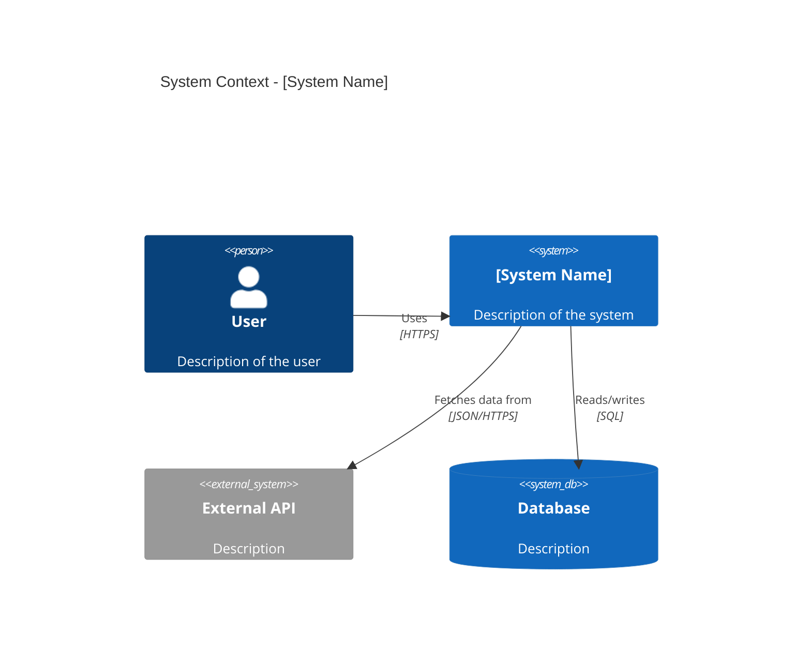

# /arch:design

Run a structured design session for a system or subsystem. Produces two artifacts:

1. **ADR** (Architecture Decision Record) -- saved to `.skilmarillion/projects/{slug}/adrs/[NNN]-[title].md`
2. **C4 Context Diagram** in Mermaid -- embedded in the ADR

---

## ON STARTUP

> **Deferred tool note:** Before calling `AskUserQuestion` for the first time, call `ToolSearch` with query `"select:AskUserQuestion"` to load the tool schema.

---

## Flow

### 1. Input Resolution

- If an argument is provided: use it as the system name or description.
- If no argument: ask the user to name or describe the system they want to design.

### 2. System Boundary Clarification

**This step is mandatory.** C4 diagram quality degrades when the system boundary is poorly defined.

Ask the user these questions as a single batch:

> Before designing, I need to understand the system boundaries. Please answer:
>
> 1. **System Name** -- What is the system called? (one short name)
> 2. **System Purpose** -- In one sentence, what does this system do?
> 3. **Users / Actors** -- Who or what interacts with this system? (people, external systems, scheduled jobs)
> 4. **External Dependencies** -- What external systems, APIs, databases, or services does this system depend on?
> 5. **Key Quality Attributes** -- Which matter most? Pick 2-3: availability, consistency, latency, throughput, security, cost, simplicity, extensibility
> 6. **What is NOT in scope** -- What is explicitly outside this system's boundary?

If the user's initial argument already answers some of these, acknowledge those answers and only ask about gaps.

**Gate:** Do not proceed until system boundary is defined (questions 1-4 answered at minimum).

### 3. Trade-off Interview

Based on the boundary answers, present the key architectural trade-offs as explicit choices. Tailor these to the system described -- do not ask generic questions.

Common trade-off axes (select the relevant ones):

- **Communication:** Synchronous (REST/gRPC) vs asynchronous (queues/streams) between components
- **Data ownership:** Shared database vs database-per-service vs hybrid
- **Consistency:** Strong consistency vs eventual consistency
- **Deployment:** Monolith vs modular monolith vs microservices
- **State management:** Stateless services + external store vs stateful services
- **Caching:** No cache vs cache-aside vs write-through

Present each as a numbered choice with a one-line pro/con:

> **Communication pattern:**
> 1. Synchronous (REST) -- simpler debugging, tighter coupling
> 2. Asynchronous (message queue) -- better fault isolation, harder to trace
> 3. Hybrid -- sync for queries, async for commands

Ask: "Which trade-offs apply to your system, and what is your preference for each?"

If the system is simple enough that trade-offs are obvious (e.g., a single-service CLI tool), state the defaults and confirm rather than asking.

**Gate:** Trade-off decisions must be confirmed before generating artifacts.

### 4. Generate ADR

Produce the ADR with these sections:

```markdown
# [NNN]. [Title]

**Date:** YYYY-MM-DD
**Status:** Proposed

## Context

[What is the issue that we are seeing that motivates this decision or change?
Include the system purpose, actors, external dependencies, and quality attributes
identified in the boundary clarification step.]

## Decision

[What is the change that we are proposing and/or doing?
Include the trade-off decisions made in step 3 with rationale for each choice.]

## Consequences

### Positive
- [What becomes easier or possible as a result of this change?]

### Negative
- [What becomes more difficult as a result of this change?]

### Risks
- [What could go wrong? What assumptions are we making?]

## C4 Context Diagram

[Mermaid diagram -- see step 5]
```

### 5. Generate C4 Context Diagram

Produce a C4Context Mermaid diagram embedded in the ADR. The diagram must include:

- The system under design as the central `System` element
- Every actor identified in step 2 as `Person` or `Person_Ext`
- Every external dependency as `System_Ext`, `SystemDb`, or `SystemQueue`
- Labeled relationships with action verbs (e.g., "Sends orders to", "Reads from")
- A `title` line

Follow these rules from the C4 model:

- Every element must have: alias, label, and description
- Use unidirectional arrows only (no `BiRel`)
- Label arrows with action verbs and technology where known (e.g., "JSON/HTTPS")
- Stay under 20 elements per diagram
- Use `_Ext` suffix for elements outside the system boundary

Example structure:



### 6. Save ADR

Resolve the artifact path:

1. Determine the project root (git root of the target project).
2. Resolve the active project context: check for an existing `.skilmarillion/projects/` structure. If found, use the active `{slug}`. If not found, ask the user for the feature slug.
3. Look for existing ADRs in `{project_root}/.skilmarillion/projects/{slug}/adrs/` to determine the next number.
4. Auto-increment: if highest existing ADR is `003-*.md`, next is `004`.
5. If no ADRs exist, start at `001`.
6. Derive ADR slug from system name: lowercase, hyphens, no special characters.
7. Final path: `{project_root}/.skilmarillion/projects/{slug}/adrs/{NNN}-{adr-slug}.md`

Create the directory if it does not exist:

```bash
mkdir -p {project_root}/.skilmarillion/projects/{slug}/adrs
```

Save the ADR using Write tool.

Present the saved path to the user:

> **ADR saved:** `.skilmarillion/projects/{slug}/adrs/{NNN}-{adr-slug}.md`

### 7. Validation

Verify the output:

1. **ADR structure:** Confirm all required sections are present (Context, Decision, Consequences, C4 Context Diagram).
2. **Mermaid syntax:** Confirm the C4Context diagram:
   - Starts with `C4Context`
   - Has a `title` line
   - Every `Rel()` references aliases that are defined above it
   - No duplicate aliases
   - Uses valid C4 element types (`Person`, `System`, `System_Ext`, `SystemDb`, `SystemQueue`, `Person_Ext`)
3. If validation fails: fix the issue inline and re-save. Do not ask the user to fix syntax errors.

### 8. Next Steps

After saving, display:

> **Design session complete.**
> - ADR: `.skilmarillion/projects/{slug}/adrs/{NNN}-{adr-slug}.md`
> - Contains: Architecture decision record with C4 context diagram
>
> **Next steps:**
> - To design the API: `/arch:api [api-name]`
> - To design the database schema: `/arch:schema [name]`
> - To generate additional diagrams: `/arch:diagram [description]`
> - To create a spec for implementation: `/plan:sdd [task]`

If the `plan` plugin is not installed, append:

> The `plan` plugin is not installed. Install with: `claude plugin add plan`

If the `impl` plugin is not installed, append:

> These artifacts can be passed to `/impl:tdd` as structured context for implementation.
> The `impl` plugin is not installed. Install with: `claude plugin add impl`

**Spec-exists hint:** After displaying the next steps, check for existing specs in `docs/` (glob for `docs/**/specs/SPEC-*.md` or `docs/**/SDD-*.md`). If a spec is found for a related feature, append:

> A spec exists at `{spec-path}` -- `/impl:tdd {spec-path}` will pick up both the spec and these design artifacts.

If multiple specs exist, list the most recently modified one and note the count:

> {count} specs found. Most recent: `{spec-path}` -- `/impl:tdd {spec-path}` will pick up both the spec and these design artifacts.

---

## WHAT NOT TO DO

- Do NOT skip the system boundary clarification step -- it is mandatory.
- Do NOT generate a C4 diagram before trade-off decisions are confirmed.
- Do NOT use `BiRel` in C4 diagrams -- unidirectional arrows only.
- Do NOT exceed 20 elements in a single diagram. Split if needed.
- Do NOT save the ADR without verifying Mermaid syntax.
- Do NOT use generic aliases like `s1`, `s2` -- use descriptive names.
- Do NOT ask trade-off questions that are irrelevant to the system described.

---

## ADR Template Reference

Standard ADR sections per Michael Nygard's format:

| Section | Required | Content |
|---------|----------|---------|
| Title | Yes | `[NNN]. [Descriptive Title]` |
| Date | Yes | ISO 8601 date |
| Status | Yes | Proposed, Accepted, Deprecated, Superseded |
| Context | Yes | Problem statement, actors, dependencies, quality attributes |
| Decision | Yes | What we decided and why (trade-off rationale) |
| Consequences | Yes | Positive, negative, and risks |
| C4 Context Diagram | Yes | Mermaid C4Context diagram |

## C4 Element Quick Reference

| Element | Usage |
|---------|-------|
| `Person(alias, "Label", "Desc")` | A human user of the system |
| `Person_Ext(alias, "Label", "Desc")` | External human actor |
| `System(alias, "Label", "Desc")` | The system under design |
| `System_Ext(alias, "Label", "Desc")` | External system dependency |
| `SystemDb(alias, "Label", "Desc")` | External database |
| `SystemQueue(alias, "Label", "Desc")` | External message queue |
| `Rel(from, to, "Label")` | Relationship with description |
| `Rel(from, to, "Label", "Tech")` | Relationship with technology |
